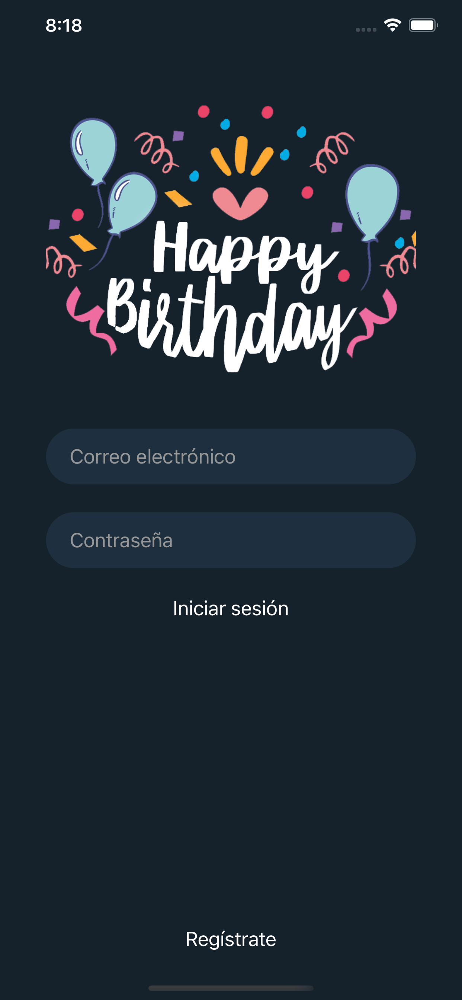
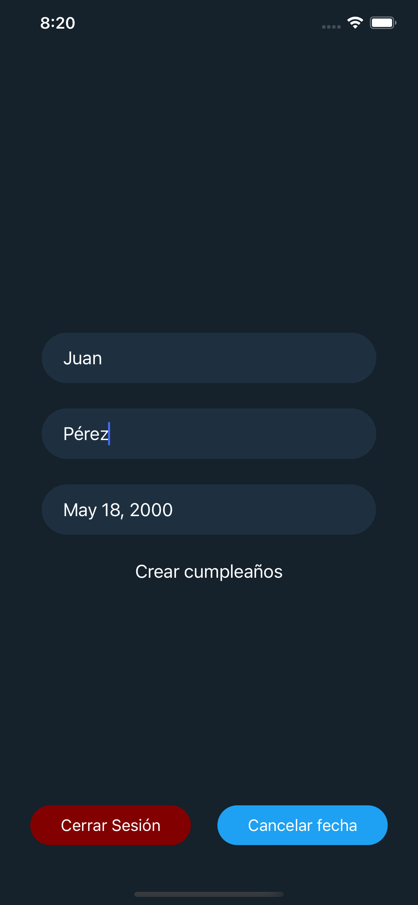
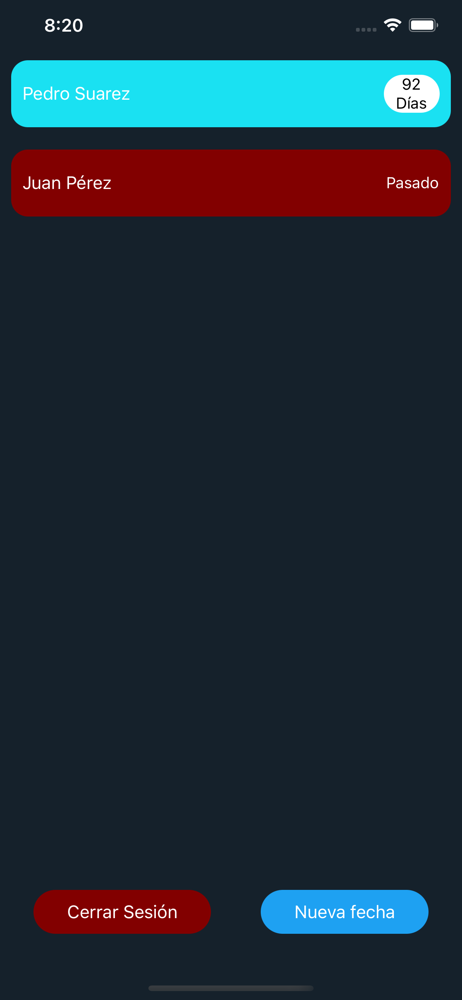

# Birthday

Simple App created with React Native to simulate a Birthday calendar. In this app you can create an account to register all your birthdays list. It will tell you how many days until next birthday or if the birthday passed.

## Development server

Run `yarn start` for a dev server. Navigate to `http://localhost:19002/`. The app will automatically reload if you change any of the source files.

## Design

### Log In

### Add birthday

### Birthday list

